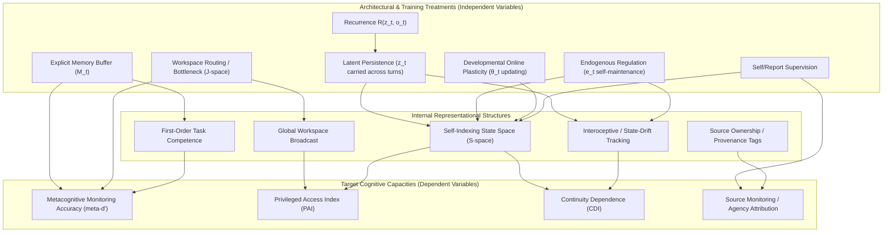

# 12. Causal Model and State Decomposition

> This document defines the canonical mathematical state vector for artificial organisms in the project and provides the structural Causal Directed Acyclic Graph (DAG) that decomposes the program's north-star research question into independently identifiable causal pathways.

---

## 1. Complete State Vector Decomposition

To prevent confounding latent recurrent dynamics with auxiliary computational history or experimental apparatus state, the complete state of a system at logical time $t$ is formally defined as the tuple:

$$X_t = (z_t, M_t, \theta_t, \omega_t, C_t, R_t, E_t)$$

### State Components & System Boundaries

| Component | Description | System Classification | Restored on Organism Reset? | Carries History Across Episodes? |
|---|---|---|---|---|
| $z_t$ | **Latent Recurrent State** (hidden state vector, GRU state, recurrent depth state) | **Organism Core** | YES (reset to $z_0$ or swapped) | YES |
| $M_t$ | **Explicit Memory** (autobiographical buffer, episodic key-value store, scratchpad) | **Organism Memory** | YES (cleared or swapped) | YES |
| $\theta_t$ | **Model Weights** (parameters of backbone, adapters, probe heads) | **Organism Structure** | NO (frozen or persistent) | YES (during Level 3 training) |
| $\omega_t$ | **Optimizer & Learning State** (Adam moments, learning rate schedule, replay buffers) | **Learning Apparatus** | EXCLUDED from Organism | YES (during online/Level 3 learning) |
| $C_t$ | **Auxiliary Computational State** (KV cache, attention activation cache, probe logits) | **Execution Apparatus** | FLUSHED per step/turn | NO (transient execution only) |
| $R_t$ | **RNG & Stochastic State** (Python/PyTorch/CUDA seeds, sampling generators) | **Test Harness** | LOCKED or SEEDED | NO |
| $E_t$ | **Environment & World State** (task environment, clock, external sensors, other agents) | **External Environment** | RESET per task/trial | NO |

### Intervention Protocol & State Surgery

When conducting causal interventions (resets, swaps, lesions, noise injections):

1. **Pure Latent Reset ($z_t \to z_0$):** $z_t$ is replaced with baseline initialization $z_0$, while $M_t$, $\theta_t$, and $E_t$ remain intact. Measures **Continuity Dependence Index (CDI)**.
2. **Memory Reset ($M_t \to \varnothing$):** Explicit memory buffer is cleared, while $z_t$ and $\theta_t$ remain intact. Isolates latent history from text memory.
3. **Full Organism Reset ($z_t \to z_0, M_t \to \varnothing$):** Both latent state and memory are restored to initial state.
4. **State Swap ($z^A_t \leftrightarrow z^B_t$):** Latent state from Organism A is transplanted into Organism B. Measures **State Transferability Index (STI)**.
5. **Compatible-Branch Patching:** Latent state $z_t$ is interpolated between two historically diverged branches of the *same* organism ($z(\alpha) = \alpha z^A_t + (1-\alpha) z^B_t$) to enforce on-manifold validity.

---

## 2. Structural Causal DAG

The north-star question asks whether a "persistent recurrent developmental trajectory" produces privileged or higher-order self-representations. To isolate mechanisms, the program decomposes this overall treatment into a structural causal model:

### Path Identification & Single-Variable Controls

To establish that a target outcome (e.g. $O_{\text{PRIV}}$ or $O_{\text{CDI}}$) is caused specifically by **Latent Persistence ($T_{\text{PER}}$)** rather than confounding variables:

1. **Controlling for Explicit Memory ($T_{\text{MEM}}$):** Match $T_{\text{MEM}}$ token count and information capacity between persistent ($T_{\text{PER}}=1$) and non-persistent ($T_{\text{PER}}=0$) conditions.
2. **Controlling for Workspace Access ($T_{\text{WSP}}$):** Compare systems with identical workspace bottleneck architecture, varying only whether hidden state $z_t$ persists across turn boundaries.
3. **Controlling for Supervision ($T_{\text{SUP}}$):** Test for emergence of self-indexing ($I_{\text{SLF}}$) in un-supervised emergence protocols versus direct self-report supervision ($T_{\text{SUP}}=1$).
