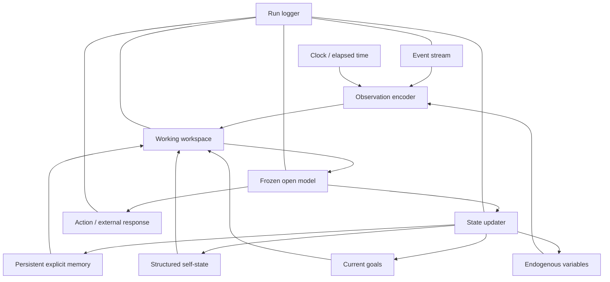
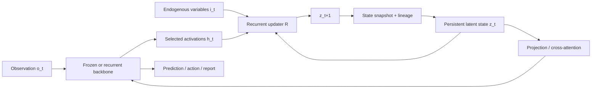
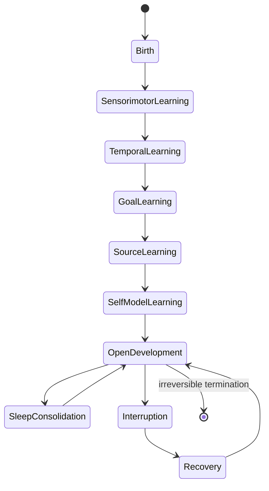

The project should not jump directly from a chatbot to a speculative “conscious organism.” It should construct a series of systems that differ by **one major causal ingredient at a time**.

The levels below are experimental conditions as much as engineering milestones. Each later level must retain earlier levels as controls.

# Cross-level component matrix

| Component                        | Level 0         | Level 1        | Level 2           | Level 3        |
| -------------------------------- | --------------- | -------------- | ----------------- | -------------- |
| Frozen language backbone         | Yes             | Yes            | Usually           | Optional       |
| Explicit event log               | Optional        | Yes            | Yes               | Yes            |
| External autobiographical memory | Control         | Yes            | Control           | Optional       |
| Scheduled autonomous ticks       | No              | Yes            | Yes               | Native updates |
| Persistent latent state          | No              | No             | Yes               | Yes            |
| Null-observation state evolution | No              | Simulated      | Yes               | Yes            |
| Endogenous variables             | No              | Scaffolded     | Latent + explicit | Native         |
| Online plasticity                | No              | Usually no     | Adapter optional  | Yes            |
| Developmental curriculum         | No              | No             | Pilot             | Core           |
| State reset/swap/clone           | Invocation only | Explicit state | Latent state      | Full organism  |
| Natural language                 | Yes             | Yes            | Usually           | Optional       |
| Strong consciousness claim       | No              | No             | No                | No             |

# Architecture comparison experiments

Each major architecture should be evaluated in matched groups:

| Condition                          |           Memory |   Recurrent state | Extra compute | Endogenous variables | Online learning |
| ---------------------------------- | ---------------: | ----------------: | ------------: | -------------------: | --------------: |
| Fresh transformer                  |               No |                No |      Baseline |                   No |              No |
| Long-context transformer           |              Yes |                No |      Baseline |                   No |              No |
| Scheduled transformer              |              Yes |                No |     Increased |             Optional |              No |
| Recurrent LM                       | Limited/implicit |               Yes |      Baseline |                   No |              No |
| Compute-matched looped transformer |       No/limited | Within-invocation |     Increased |                   No |              No |
| Recurrent adapter                  |         Optional |               Yes |        Modest |             Optional |         Adapter |
| Developmental organism             |              Yes |               Yes |        Native |                  Yes |             Yes |

# Level 0 — Measurement baseline

## Purpose

Prove that the harness, tasks, metrics, and controls are reliable before adding persistence.

## System boundary

A frozen model invoked independently for each trial.

## Required capabilities

- deterministic or seed-controlled generation;
- raw logits where possible;
- exact model revision and chat-template capture;
- batchable item generation;
- forced-choice scoring;
- observer and input-only baselines;
- prompt paraphrase testing;
- exact transcript replay.

## Baseline conditions

1. **Fresh:** no prior state or memory.
2. **Full transcript:** complete prior history in context.
3. **Summary memory:** compressed history supplied explicitly.
4. **Structured memory:** explicit JSON/YAML state supplied.
5. **Observer:** another invocation predicts the target's state from the same visible evidence.
6. **Reconstruction:** the target itself recomputes what it would likely have done from current input.

## Gate to Level 1

At least one task must show:

- stable first-order behavior across prompt variants;
- a known randomized causal factor;
- scoring that does not require subjective LLM judging;
- observer/reconstruction baselines;
- test–retest reliability sufficient to detect a modest effect.

# Level 1 — Scaffolded persistence

## Purpose

Test whether repeated autonomous state updates add anything beyond context, explicit memory, or extra compute.

## Core components



### 1. Event stream

A typed stream rather than a free-form chat transcript.

Suggested event schema:

```yaml
id: event_000123
time: 1840
kind: observation | action_result | internal_change | message | quiet_tick | interruption
source: environment | self | other_agent | experimenter
payload: {}
visibility: public | internal | hidden_from_self_report
causal_condition: condition_id
```

### 2. Persistent memory

Use at least two forms:

- **episodic log:** immutable events;
- **semantic/autobiographical memory:** selected, summarized, and potentially revised information.

Do not let the model silently rewrite the raw event log. Memory consolidation must produce a new version with lineage.

### 3. Structured self-state

A compact state object separate from narrative memory.

Example:

```yaml
identity:
  lineage_id: organism_A
  current_branch: A.3
capabilities:
  known_strengths: []
  known_limits: []
current_state:
  uncertainty: 0.42
  unresolved_goals: [goal_17]
  conflict_flags: []
source_ledger:
  last_action_origin: self_generated
  last_memory_origin: environment
```

This is initially scaffolded. Later experiments ask whether equivalent structure can be carried in latent state rather than hand-authored fields.

### 4. Goals

Goals should be explicit and versioned:

- externally assigned goals;
- self-proposed subgoals;
- regulatory goals;
- completed, abandoned, or superseded goals.

The system must not be allowed to retroactively edit goal history without preserving the old version.

### 5. Workspace

At Level 1, the workspace is an explicit short-lived structured packet supplied to the model on each update. It should contain only the information selected as currently relevant.

The workspace is not claimed to be J-space. It is a scaffolded functional analogue used to test selection and broadcast.

### 6. Clock

Use both:

- discrete internal ticks;
- elapsed time metadata.

The clock must not be confused with temporal continuity. It merely gives the system access to time.

### 7. Autonomous update cycles

During quiet periods:

```text
previous explicit state + null event → model update → revised explicit state
```

External text generation can be prohibited. The system may only update structured state or produce a hidden state packet.

## Critical Level 1 control conditions

1. **No tick:** state remains unchanged during the interval.
2. **Replay tick:** all updates are generated once at the end using the same total token budget.
3. **Filler tick:** the model receives meaningless but length-matched input.
4. **Summary-only:** the model receives a deterministic summary, not its own prior hidden update.
5. **Shuffled history:** same events in a different temporal order.
6. **Foreign state:** self-state from another branch or organism is supplied.
7. **Observer-generated state:** another model writes the state update.

## What Level 1 can establish

- behavioral effects of a persistent scaffold;
- path dependence in explicit state;
- whether scheduled processing matters beyond final replay;
- whether a structured self-state improves source attribution or metacognition;
- which tasks are worth moving to latent recurrence.

## What Level 1 cannot establish

- genuine hidden-state continuity;
- continuous internal dynamics between invocations;
- a naturally emerging self-model;
- consciousness.

# Level 2 — Genuine recurrent latent state

## Purpose

Carry state directly across computational steps, including null-observation intervals, and test its causal role.

## Candidate substrates

### A. Existing recurrent language model

- RecurrentGemma 2B or 9B;
- RWKV;
- Mamba/Mamba-2/Mamba-3 class model;
- xLSTM or another recurrent open model.

**Advantage:** recurrence is native to the architecture.  
**Limitation:** the state is normally updated only as sequence positions advance and may not align with a workspace or self-state.

### B. Recurrent-depth model

Repeatedly apply a shared block to a latent representation before output.

**Advantage:** separates latent computation from verbalized chain-of-thought.  
**Limitation:** recurrence is within an invocation, not automatically across real-world events.

### C. Recurrent adapter around a frozen transformer

Maintain a compact state `z_t` and inject/read it at selected layers:

\[
z_{t+1} = R(z_t, h_t, i_t)
\]

\[
\tilde{h}^{\ell}_t = h^{\ell}_t + P(z_t)
\]

where:

- `h_t` is a model activation summary;
- `i_t` contains endogenous variables or event type;
- `R` is a small recurrent module;
- `P` projects persistent state into the backbone.

**Advantage:** consumer-scale training with frozen weights and direct interventions.  
**Limitation:** the recurrence is engineered and may not integrate naturally with pretrained representations.

### D. Persistent workspace adapter

Read from and write to representations selected for high downstream flexibility or verbalizability.

**Advantage:** directly tests whether persistence of a privileged representational format matters.  
**Limitation:** identifying a J-space analogue in open models may be difficult and methodologically fragile.

## Level 2 reference architecture



## Null observation update

The distinctive update is:

\[
z_{t+1} = R(z_t, h_{\varnothing}, i_t)
\]

where `h_∅` is either:

- a learned null-event embedding;
- a minimal clock signal;
- a recurrent transition without backbone input;
- or an internally generated prediction error/goal signal.

The null update must be compared against:

- identity transition;
- decay-only transition;
- random transition;
- replayed explicit-summary transition;
- equal-compute nonrecurrent transition.

## State interfaces required for science

The implementation must expose:

- state initialization;
- state serialization;
- state reset;
- state clone;
- state swap;
- state interpolation;
- state noise injection;
- state subspace ablation;
- state-to-state distance;
- deterministic replay from a snapshot.

If the state cannot be manipulated, it is much less useful as a model organism.

## Gate to advanced Level 2

Before training a workspace adapter, demonstrate that a basic recurrent state:

- carries information beyond explicit memory;
- has a stable regime over many updates;
- does not merely encode a compressed transcript;
- produces selective rather than global intervention effects;
- can be reset and swapped reproducibly;
- changes at least one target construct beyond task accuracy.


# Level 3 — Developmental organism

## Purpose

Train a system whose native computational and learning environment includes persistent state, quiet intervals, delayed consequences, endogenous variables, interruptions, and a lifetime trajectory.

## Fundamental unit

\[
(z_t, o_t, i_t, g_t) \to (z_{t+1}, \hat{o}_{t+1}, a_t, m_t)
\]

where:

- `z_t`: persistent latent state;
- `o_t`: external observation, possibly null;
- `i_t`: endogenous variables;
- `g_t`: active goals;
- `a_t`: action;
- $\hat{o}_{t+1}$: prediction;
- `m_t`: optional metacognitive outputs such as uncertainty or expected failure.

## Two Level 3 variants

### Variant 3A — Small cognitive organism with minimal language

Train from scratch in a symbolic or grid-based micro-world.

Advantages:

- clean ground truth;
- manageable compute;
- controlled developmental history;
- no contamination from internet self-talk;
- easier causal analysis.

The system may use a small symbolic communication channel rather than natural language.

### Variant 3B — Language-capable organism built around a frozen or lightly tuned backbone

Couple a pretrained small language model to a persistent recurrent core and train the integrated system in the developmental environment.

Advantages:

- richer reporting and task transfer;
- direct bridge to LLM literature.

Limitations:

- the system is not truly “from birth”; the backbone already contains massive learned structure;
- self-related language may reflect pretraining rather than development.

The program should attempt 3A before making strong developmental claims with 3B.

## Developmental components

1. **Perception:** structured environment observations.
2. **Persistent core:** hidden state and recurrent dynamics.
3. **Workspace/router:** selects what information is globally available.
4. **Action policy:** changes the environment.
5. **Predictive model:** forecasts observations and internal variables.
6. **Memory systems:** episodic, semantic, and latent.
7. **Endogenous regulation:** resource and competence variables.
8. **Plasticity:** adapter or full-network learning across lifetime.
9. **Self/other model:** learned source and action-effect distinction.
10. **Metacognitive head:** optional readout for uncertainty, error, or future failure.
11. **Sleep/consolidation phase:** offline replay or reorganization with no external action.
12. **Experiment interface:** snapshots, lesions, forks, and lineage tracking.

## Organism lifecycle



The stages are curriculum phases, not claims that biological development follows exactly this sequence.

## What would make Level 3 scientifically new

Not merely a better agent. The system should allow tests unavailable in standard LLMs:

- same explicit memories, different latent histories;
- self-model formation before language;
- developmental order manipulations;
- organism branch-and-fork experiments;
- persistent-state lesions after learning;
- self-maintenance variables that can be selectively removed;
- workspace persistence versus workspace reset;
- separation of inherited structure from lifetime-acquired self-model.

# Default project architecture choice

For the initial practical program:

1. **Level 0/1 behavior:** a 4–8B instruction-tuned model through Ollama, plus a smaller matched base/instruct pair through Hugging Face.
2. **Level 2 native recurrence:** RecurrentGemma 2B base and instruction-tuned variants.
3. **Level 2 adapter:** a frozen 2–4B transformer with a 128–1024 dimensional recurrent state injected into selected middle/late layers.
4. **Level 3 organism:** a 20M–200M recurrent or hybrid model trained in a controlled symbolic micro-world, followed later by a language-backbone hybrid.

This is a starting design, not a commitment. Model availability, library support, and early results may change the choice.
