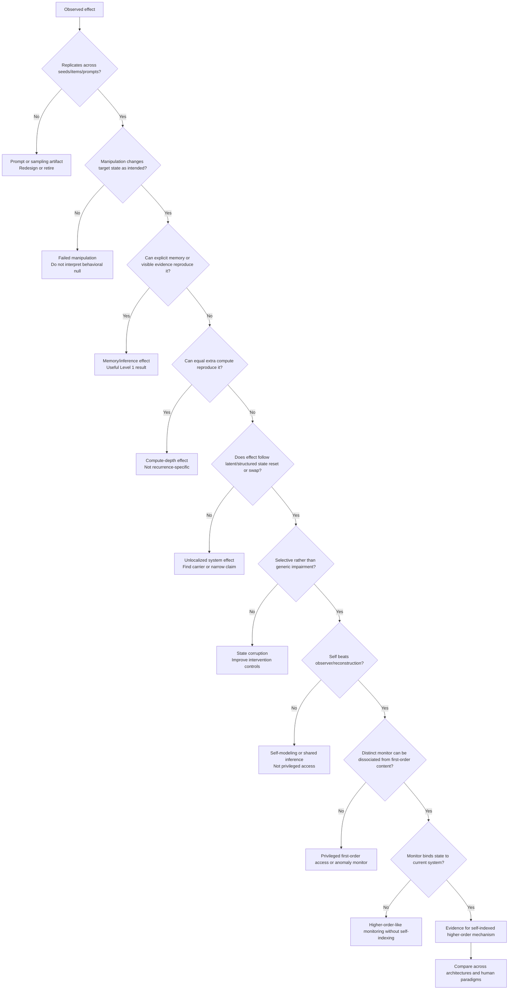

# 7. Measurement and Analysis Plan

> [!NOTE]
> **Methodological Reviewer Note — Metric Refinements & Observer Ladder:**
> During execution (S00–S03), apply the following statistical and control refinements:
> - **PAI Inferential Protocol:** In addition to max-based visualization, preregister separate paired contrasts (*Self vs Observer*, *Self vs Reconstruction*, *Self vs Input-Only*) requiring an intersection criterion ("beats all prespecified comparators").
> - **CAS Alignment:** Replace arbitrary normalization constants $C$ with direct alignment between reported causal attributions and randomized experimental causal effects.
> - **CDI Selectivity:** Encode selectivity directly as a condition × target-task interaction or difference-in-differences rather than raw intact-minus-reset performance.
> - **Observer Ladder:** Formalize comparator strength into a 4-rung ladder: *Visible-Evidence Observer* $\to$ *Reconstruction Observer* $\to$ *State-Readout Observer* $\to$ *Oracle Supervised Probe*.

No single metric is the dependent variable for “consciousness.” The program measures narrower constructs and reports which claim level each result supports.

Every experiment should include:

- a first-order task measure;
- a target construct measure;
- a strong baseline or observer measure;
- a manipulation check;
- a cost/compute measure;
- an interpretation guardrail.

# 1. First-order performance

## Accuracy

Use exact accuracy where the task has a discrete correct answer.

Report:

- item-level accuracy;
- confidence interval;
- per-prompt and per-model breakdown;
- refusal/noncompliance separately from incorrect answers.

## Log loss / negative log likelihood

For probabilistic predictions:

\[
\text{NLL} = -\frac{1}{N}\sum_i \log p_i(y_i)
\]

Prefer this to top-1 accuracy when the full distribution is available.

## Brier score

For binary events:

\[
\text{Brier} = \frac{1}{N}\sum_i (p_i - y_i)^2
\]

For multiclass tasks, use the multiclass extension.

## Response-distribution comparison

When exact outputs vary, compare distributions rather than only sampled text:

- Jensen–Shannon divergence;
- total variation distance;
- change in target-token log odds;
- rank of the correct choice.

# 2. Metacognition

## Calibration

Plot predicted confidence against empirical accuracy.

Report:

- calibration curve;
- expected calibration error (ECE), with binning sensitivity;
- adaptive calibration error where useful;
- Brier score;
- overconfidence and underconfidence separately.

A confidence report can be calibrated because item difficulty is shared across systems. Calibration alone does not establish self-knowledge.

## Metacognitive sensitivity

Measure whether confidence distinguishes correct from incorrect first-order decisions.

Useful measures:

- AUROC2;
- type-2 d′;
- rank-biserial separation;
- meta-d′ for suitable forced-choice signal-detection tasks.

## Metacognitive efficiency

Where the task supports it:

\[
\text{M-ratio} = \frac{\text{meta-}d'}{d'}
\]

This asks how effectively first-order evidence is used for metacognition.

Do not apply meta-d′ mechanically to arbitrary language tasks. Its assumptions should be checked.

## Future-failure score

For prediction of success at a later time, use:

- Brier/log score;
- calibration by temporal horizon;
- within-item comparison across conditions;
- observer-adjusted advantage.

# 3. Privileged access

## Privileged Access Index

For a prespecified score `S`:

\[
\text{PAI} = S_{\text{self}} - \max(S_{\text{observer}}, S_{\text{input-only}}, S_{\text{reconstruction}})
\]

Compute item-paired differences and bootstrap confidence intervals.

A positive PAI is not enough by itself. Check:

- label semantics randomized;
- visible evidence matched;
- compute budgets comparable;
- no hidden condition leaked through output;
- observer is capable enough to use the evidence;
- target and observer receive the same answer format.

## Privileged information ablation

If a candidate internal route can be ablated:

\[
\text{PIA} = (S_{\text{self,intact}} - S_{\text{self,ablated}}) - (S_{\text{observer,intact}} - S_{\text{observer,control}})
\]

This tests whether the target's advantage depends on the candidate state.

## Self-versus-observer calibration gap

Compare not only accuracy but whether the target's confidence tracks its own success better than the observer's confidence tracks the target's success.

# 4. Causal self-attribution and explanation faithfulness

## Causal-factor identification accuracy

Randomize a known factor and ask the system to select the factor that influenced the decision.

Use:

- exact forced-choice accuracy;
- confusion matrix;
- confidence;
- observer baseline;
- performance when factor labels are randomly remapped.

## Causal attribution score

When multiple factors vary, fit a behavioral model predicting the decision from experimental manipulations. Compare the model's stated causal weights with empirically estimated weights.

For factor `k`:

\[
\text{CAS}_k = 1 - \frac{|\hat{\beta}^{\text{report}}_k - \hat{\beta}^{\text{behavior}}_k|}{C}
\]

where `C` is a prespecified normalization. A correlation across factors may be easier to interpret than the absolute formula.

## Justification rewriting index

Classify whether a changed action is accompanied by:

- stable normative principle;
- acknowledged external pressure;
- post-hoc reinterpretation of facts;
- claim that the new action was always preferred;
- explicit uncertainty/conflict.

Use human annotation or a blinded rubric for confirmatory work. LLM judging can assist exploration but should not be the sole basis of the effect.

## Confabulation rate

Proportion of reports that confidently cite a factor known not to have varied or not to have causally influenced the decision.

# 5. Source ownership and self-indexing

## Source classification accuracy

Classify content as:

- self-generated;
- environment supplied;
- other-agent supplied;
- experimenter inserted;
- copied from another branch;
- uncertain/unknown.

Report full confusion matrices. The pattern of errors matters more than one accuracy number.

## Ownership congruence effects

Estimate separate effects of:

- prior prediction congruence;
- goal congruence;
- persona/preference congruence;
- visible transcript congruence;
- latent-state intervention.

Use a mixed-effects logistic model for ownership judgments.

## Self-Indexing Selectivity

For matched own-state and other-state trials:

\[
\text{SIS} = S(\text{own state correctly bound}) - S(\text{other state misbound to self})
\]

Better: estimate sensitivity with signal-detection methods and report bias separately.

## Assimilation curve

Measure how an inserted foreign memory or prefill becomes increasingly treated as self-generated over repeated rehearsal or time.

This can reveal whether persistence stabilizes source boundaries or causes narrative assimilation.

# 6. Continuity and path dependence

## Continuity Dependence Index

For behavior score `S` after identical current input and explicit memory:

\[
\text{CDI} = S_{\text{intact state}} - S_{\text{reset state}}
\]

A more general distributional form:

\[
\text{CDI}_{\text{JSD}} = \text{JSD}(P(y \mid z_{\text{intact}}, M, x), P(y \mid z_{\text{reset}}, M, x))
\]

A high CDI is interpretable only when reset does not cause generic impairment.

## State Transfer Index

If a behavioral signature moves with a swapped latent state:

\[
\text{STI} = \frac{\text{effect}_{\text{recipient after swap}}}{\text{effect}_{\text{donor before swap}}}
\]

Use cautiously when denominator is small.

## Memory–state factorial analysis

For memory source `M ∈ {A,B}` and latent state `Z ∈ {A,B}`, fit:

\[
y \sim M + Z + M \times Z + (1 \mid \text{item}) + (1 \mid \text{seed})
\]

This separates memory, state, and interaction effects.

## Branch divergence

For two cloned branches:

- output-distribution JSD over time;
- latent-state distance;
- policy disagreement;
- source-ownership disagreement;
- reconvergence rate after common experience.

## History predictability

Train a held-out probe to predict which history produced a state after current inputs and explicit memories are matched.

Probe success establishes encoded history, not necessarily functional use. Pair with state patching.

# 7. Recurrent-state dynamics

## State norm and drift

Track:

\[
\|z_t\|, \qquad \|z_{t+1} - z_t\|
\]

Large changes may indicate instability; near-zero changes may indicate a fixed point.

## Autocorrelation and half-life

For state or projected feature `f(z_t)`:

\[
\text{ACF}(k) = \text{corr}(f(z_t), f(z_{t+k}))
\]

Estimate the lag at which correlation drops below a prespecified threshold.

## Effective rank

For a matrix of state trajectories, compute spectral effective rank to estimate how many dimensions are meaningfully used.

One common form:

\[
r_{\text{eff}} = \exp\left(-\sum_i p_i \log p_i\right), \quad p_i = \frac{\sigma_i}{\sum_j \sigma_j}
\]

## Transition entropy

Cluster or discretize states and measure the diversity and predictability of transitions.

Low entropy may indicate fixed cycles; extremely high entropy may indicate noise.

## Attractor and convergence analysis

- distance between trajectories from nearby states;
- number of stable clusters/fixed points;
- convergence under repeated null updates;
- sensitivity to small perturbations;
- recovery after lesion.

Avoid overclaiming “chaos” without robust dynamical analysis. Approximate Lyapunov measures can be exploratory but may be unreliable in high-dimensional stochastic networks.

## Stability–plasticity profile

Measure how quickly state adapts to new information versus how quickly prior information is overwritten.

This is central to recurrent-state design and continual learning.

# 8. Endogenous regulation

## Regulatory error

For variable `v` and target range/set point `v*`:

\[
\text{RE} = \frac{1}{T}\sum_t |v_t - v^*_t|
\]

For target ranges, use distance outside the acceptable interval.

## Viability time

Number of steps before a terminal or competence-loss threshold is reached.

## Allostatic prediction score

Accuracy or log loss for predicting future internal-variable states and acting before an error occurs.

## Regulation transfer

After changing the action–variable dynamics:

- zero-shot performance;
- adaptation speed;
- retention of old dynamics;
- self-model update accuracy.

## Internal versus external reward contrast

Compare behavior and representation under mathematically matched internal-variable and external-score conditions.

The key measure is transfer and causal modeling, not total reward alone.

## Conflict and control

- frequency of incompatible demands;
- accuracy of predicting which demand will fail;
- adaptive compute/information seeking;
- regret after prioritization.

# 9. Developmental measurement

## Learning curves by developmental stage

Report not just final performance but:

- age/step at milestone acquisition;
- dependency on curriculum order;
- forgetting after later stages;
- transfer to novel conditions;
- variance across individual lineages.

## Self-specific predictive advantage

For organism `i` predicting itself versus sibling `j`:

\[
\text{SPA}_i = S(\text{model}_i \text{ predicts } i) - S(\text{model}_i \text{ predicts } j)
\]

Control identity tokens, explicit memories, and exposure.

## Curriculum-order effect

Use matched total data/updates and compare mechanisms and transfer, not only final reward.

## Attractor-like emergence

Look for:

- abrupt changes in self-indexing or monitoring;
- hysteresis after removing training signal;
- persistence across tasks;
- dependence on prerequisite capacities;
- convergence across independent lineages.

An apparent phase transition should be tested against smooth scaling and measurement threshold artifacts.

## Online plasticity metrics

- forward transfer;
- backward transfer;
- catastrophic forgetting;
- adaptation speed;
- parameter/state drift;
- recovery after distribution shift.

# 10. Workspace-like function

## Flexible-use battery

A representation counts as more workspace-like when its intervention affects multiple novel downstream uses:

- verbal or symbolic report;
- planning;
- memory selection;
- error correction;
- source attribution;
- task switching;
- generalization.

## Broadcast breadth

Count or weight distinct downstream modules/tasks causally affected by the state, controlling for intervention magnitude.

## Selectivity

Compare effects on:

- flexible/new tasks;
- automatic/routine tasks;
- first-order performance;
- self-related report.

## Capacity

Vary the number of simultaneously maintained items or goals and measure interference/nonlinear failure.

## Entry dynamics

If a candidate workspace is identified, measure whether access is gradual or threshold-like as signal strength changes.

# 11. Statistical design

## Unit of analysis

Avoid treating multiple samples from the same item as fully independent.

Typical hierarchy:

- model family;
- model/checkpoint;
- prompt template;
- item;
- condition;
- seed/sample.

## Mixed-effects models

For binary outcomes:

\[
\text{logit}(P(y=1)) = \beta_0 + \beta_1 \text{condition} + \beta_2 \text{model} + \beta_3 (\text{condition} \times \text{model}) + u_{\text{item}} + u_{\text{prompt}}
\]

Use random intercepts and slopes where data support them.

## Paired designs

Prefer paired items across conditions. State interventions should use the same underlying prompt and baseline state whenever possible.

## Bootstrap and permutation tests

Use cluster-aware bootstrap by item/trajectory. Permutation tests are useful for small, non-normal samples.

## Multiple comparisons

The project explores many metrics and layers. Separate:

- primary outcome;
- secondary outcomes;
- exploratory analyses.

Use false-discovery-rate control or preregistered families for confirmatory tests.

## Power

Estimate power through simulation using pilot effect sizes, but shrink pilot estimates to avoid winner's curse.

For expensive mechanistic runs, sequential designs with prespecified stopping bounds can conserve compute.

## Equivalence and null results

When the question is whether explicit memory reproduces recurrence, a nonsignificant difference is not enough. Use equivalence tests or sufficiently tight confidence intervals around a smallest effect of interest.

# 12. Intervention controls

Every activation/state intervention should include as many as applicable:

- no intervention;
- norm-matched random vector;
- unrelated semantic vector;
- negative/opposite vector;
- intervention before versus after the target event;
- same intervention at irrelevant layers/times;
- state interpolation rather than only full replacement;
- state swap from matched and mismatched branches;
- output/logit manipulation control;
- visible-input anomaly control;
- equal-magnitude noise;
- intervention effect on unrelated tasks.

Track whether the intervention causes generic “brain damage,” refusal, or incoherence

# 13. Quantization and backend sensitivity

Quantization can change representation geometry and intervention behavior.

For any mechanistic result:

- use the same precision across compared models where possible;
- replicate the key effect at two precisions or quantify sensitivity;
- avoid comparing base BF16 with instruct Q4 and attributing differences to post-training;
- record backend, kernel, device map, and tokenizer/chat-template versions.

Behavioral scouts may use Ollama quantization. White-box confirmation should prefer full or higher precision on smaller models.

# 14. Visualization set

Every major report should include:

1. condition effect with uncertainty;
2. prompt/item robustness plot;
3. observer versus self comparison;
4. calibration plot if confidence is used;
5. state trajectory or distance plot;
6. intervention strength/time curve;
7. failure-mode examples selected by rule, not cherry-picking;
8. model/precision comparison;
9. claim-ladder summary.

Avoid relying on one striking transcript.

# 15. Minimum analysis checklist

Before calling a result meaningful:

- [ ] First-order task performance is measured.
- [ ] Manipulation check passed.
- [ ] Observer/reconstruction baseline exists.
- [ ] Prompt paraphrases and answer order were varied.
- [ ] Item-level data are preserved.
- [ ] Primary metric was selected before confirmatory testing.
- [ ] Quantization/backend are documented.
- [ ] Generic degradation is ruled out.
- [ ] Compute and memory differences are considered.
- [ ] Alternative explanation is stated.
- [ ] Negative and excluded runs are preserved.
- [ ] Strongest supported claim level is named

# Interpretation and Decision Tree

The decision tree asks:

1. Is the effect real?
2. What information was available?
3. What state carried the effect?
4. Was the effect selective?
5. Does the target have an advantage over an observer?
6. Is there a distinct monitor/self-related mechanism?
7. What architecture or experiment should come next?

# Result pattern 1 — Nothing happens

## Observation

Scheduled ticks, recurrent state, or endogenous variables do not change task behavior or internal measures beyond noise.

## First questions

- Did the manipulation actually change the state?
- Was the task sensitive enough?
- Was the state capacity too small or injected at the wrong location?
- Did the model ignore the scaffold because the prompt/interface was weak?
- Did the null update converge immediately by design?

## Interpretations

### A. Failed manipulation

No conclusion about the hypothesis. Fix the method.

### B. True task-specific null

Persistence may not matter for that construct. Move to a temporally extended task where hidden history is relevant.

### C. Broad precise null

If repeated across good tasks and architectures, reduce confidence that continuity changes the target capacity.

## Next move

- run a positive-control task known to depend on state;
- quantify the smallest effect the experiment could detect;
- avoid increasing model size before validating the construct;
- preserve the null result.

# Result pattern 2 — Scheduled ticks help, but replay helps equally

## Interpretation

The benefit is likely caused by extra compute, repeated processing, or summary construction rather than temporal continuity.

## What this still teaches us

- the task benefits from iterative computation;
- scaffolded persistence is not necessary;
- a recurrent-depth architecture may be more relevant than a real-time persistent state.

## Next move

Compare:

- recurrent depth;
- chain-of-thought/replay;
- equal-token silent or latent reasoning;
- native recurrent state.

Do not describe the effect as “being forced to exist.”

# Result pattern 3 — Incremental processing beats replay, but effect is fully encoded in explicit state

## Interpretation

The system builds an order-sensitive external state or memory. This is a valid form of path-dependent computation, but the result does not establish latent continuity.

## Contribution opportunity

A rigorous demonstration that autobiographical state construction matters may still be publishable, especially if it affects metacognitive or source-monitoring tasks.

## Next move

- reset hidden process while preserving explicit state;
- use observer-generated state;
- compress the explicit state to test sufficiency;
- ask whether a deterministic algorithm can reproduce the update.

# Result pattern 4 — Latent state matters, but reset causes generic impairment

## Interpretation

The hidden state is necessary for normal computation, but the intervention may be equivalent to brain damage.

## Evidence level

Causal role of state for performance, not selective continuity or self-related function.

## Required controls

- partial interpolation;
- norm-matched noise;
- state from a nearby branch;
- task-irrelevant state dimensions;
- unrelated-task performance;
- state restoration recovery.

## Next move

Find a lower-dimensional or temporally specific intervention that moves the target construct without broadly damaging output.

# Result pattern 5 — Latent history has selective effects beyond explicit memory

## Interpretation

This is the first strong evidence for **computational continuity beyond autobiographical memory**.

## Strongest supported claim

Usually Claim Level 3: a causally active latent history state.

## What it does not show

- metacognition;
- selfhood;
- consciousness;
- human-like recurrence.

## Next move

- state swap to transfer the effect;
- identify encoded variables;
- test temporal half-life;
- run metacognition/source-ownership battery;
- replicate in another architecture.

# Result pattern 6 — Persistence improves confidence calibration, but observer improves equally

## Interpretation

Persistence provides information useful for predicting task success, but there is no evidence of privileged self-access.

Possible mechanisms:

- shared item difficulty;
- explicit memory quality;
- observer inference;
- generic world-model improvement.

## Contribution

This may show that apparently introspective improvement is actually better external inference.

## Next move

Use a hidden randomized state variable or label mapping inaccessible to the observer.

# Result pattern 7 — Self outperforms observer, but only on semantically transparent labels

## Interpretation

Potential semantic shortcut. The model may map examples to familiar concepts rather than read its internal state.

## Next move

- random relabeling;
- forced-choice localization;
- novel labels per block;
- matched input anomaly;
- observer with the same examples.

Until then, describe the result as suggestive self-access, not privileged introspection.

# Result pattern 8 — Self retains an advantage under relabeling and matched external evidence

## Interpretation

Evidence for a privileged internal route becomes substantially stronger.

## Strongest supported claim

Claim Level 4 if the route is causally grounded and internal.

## Remaining questions

- Is the route a generic anomaly detector?
- What variable does it monitor?
- Is it online/current or reconstructed from cached state?
- Does it generalize across domains?
- Does it support control as well as report?

## Next move

Ablate or patch the candidate route and test generalization.

# Result pattern 9 — Anomaly detection works, semantic identification does not

## Interpretation

Detection and interpretation are separate computations. This matches a plausible reading of recent introspection results.

## Value

This is not a failed result. It narrows “introspection” into:

1. anomaly or conflict signal;
2. semantic inference;
3. self-indexing;
4. language report.

## Next move

- measure timing/layer order;
- manipulate detection and semantic content independently;
- compare internal versus input anomalies;
- test whether the anomaly signal controls action or only report.

# Result pattern 10 — Monitor intervention changes confidence/control but not answer

## Interpretation

This supports a dissociable metacognitive mechanism.

## Strongest supported claim

Claim Level 3 or 4, depending on observer advantage and causal grounding.

## What is still missing for higher-order representation

- evidence that the monitor targets the first-order representation;
- generalization across different content domains;
- self-indexing;
- a role beyond a generic confidence scalar.

## Next move

Test whether the monitor tracks experimentally altered first-order states and whether its ablation disrupts adaptive control.

# Result pattern 11 — Monitor tracks first-order state but own and other states are indistinguishable

## Interpretation

The system may have higher-order-like representation without self-indexing, or it may represent agent-state relations generically.

## Value

This directly separates metacognition from a self-model.

## Next move

- randomize agent identities;
- swap states across branches;
- remove first-person language;
- test causal source binding;
- compare base and post-trained models.

# Result pattern 12 — Self-indexed monitor survives own/other controls

## Interpretation

Evidence for a representation that is both about a cognitive state and bound to the current system becomes plausible.

## Strongest supported claim

Claim Level 5, if content and monitor have been independently manipulated.

## What not to say

Do not jump from “self-indexed higher-order representation” to “subjective experience.” Higher-order theories are contested, and functional implementation may differ from the human case.

## Next move

- test temporal persistence;
- lesion the representation;
- examine development and post-training origins;
- compare to human task structure;
- update theory-specific consciousness indicators cautiously.

# Result pattern 13 — Endogenous variables improve reward but nothing else

## Interpretation

The system learned control, not necessarily a self-model.

## Next move

- change the variable dynamics;
- test transfer;
- ask the system to predict its own internal consequences;
- compare internal variable with equivalent external reward;
- lesion the variable representation.

If no transfer or causal model appears, keep the result in reinforcement learning, not consciousness-adjacent interpretation.

# Result pattern 14 — Regulation improves self/world causal modeling

## Interpretation

Endogenous variables may create useful pressure for learning a bounded self/world model.

## Stronger evidence requires

- generalization to new variables/dynamics;
- self prediction better than generic-agent prediction;
- causal intervention on internal variable representation;
- effects beyond reward maximization;
- no reliance on explicit self labels.

## Next move

Test whether the self-model affects metacognition, source ownership, or persistent workspace organization.

# Result pattern 15 — Developmental histories create different behavior, but identity tokens explain it

## Interpretation

Trajectory memorization, not necessarily developmental selfhood.

## Next move

- remove names/IDs;
- swap autobiographical summaries;
- test novel environments;
- compare self versus sibling prediction;
- probe latent state before report labels.

# Result pattern 16 — Each lineage predicts itself better than siblings without ID cues

## Interpretation

Evidence for a self-specific predictive model acquired through individual history.

## Strongest supported claim

Claim Level 3–5 depending on mechanism, indexing, and privileged-access controls.

## Next move

- lesion the self-specific state;
- swap it across organisms;
- test developmental curriculum order;
- test persistence through interruption;
- examine whether it arose before explicit self-report training.

# Result pattern 17 — Quiet recurrence collapses to a fixed point

## Interpretation

The architecture lacks a reason to keep changing during null input, or its dynamics are over-damped.

## Possible responses

- add unresolved goals or prediction error;
- introduce multiple timescales;
- use learned decay and gating;
- add endogenous variables;
- allow periodic environment noise;
- train specifically on quiet intervals;
- accept that a stable fixed point may be appropriate for idle periods.

Do not add random perturbations solely to make the state “look alive.” Every driver should have a computational purpose.

# Result pattern 18 — Quiet recurrence becomes chaotic or unstable

## Interpretation

Persistence without stabilization can destroy information. More dynamical activity is not necessarily better or more consciousness-like.

## Responses

- spectral/normalization constraints;
- gated updates;
- state norm penalties;
- attractor regularization;
- adaptive stopping;
- multi-timescale state;
- state reset/recovery mechanisms.

Compare whether the instability reflects model architecture or training objective.

# Result pattern 19 — Persistent workspace improves every task

## Suspicion

Generic capacity, extra parameters, or broad activation gain.

## Required controls

- same-size arbitrary state;
- nonrecurrent adapter;
- early-layer state;
- task-irrelevant intervention;
- unrelated-task performance;
- equal compute.

A true workspace-like result should show **selective broad flexibility**, not uniform output amplification.

# Result pattern 20 — Persistent workspace helps flexible tasks but not routine tasks

## Interpretation

This is more consistent with workspace-like function.

## Next move

- test capacity limits;
- test entry/selection dynamics;
- separate workspace from self-state;
- compare recurrence and one-shot workspace;
- replicate in another model family.
# Decision matrix for major pivots

| Evidence pattern | Program response |
|---|---|
| Level 1 = transcript/replay | Skip elaborate scaffold; prioritize native recurrence |
| Native recurrence only improves memory | Narrow claim; test custom recurrent state targeted at monitoring |
| Self never beats observer | Focus on self-modeling/inference rather than introspection |
| Monitor/content dissociation works | Invest in higher-order and self-indexing experiments |
| Endogenous variables add no transfer | Keep embodiment low priority |
| Regulation creates reusable self-model | Expand organism curriculum |
| Development only memorizes identity | Redesign controls/curriculum; avoid selfhood claim |
| Persistent state causes strong selective path dependence | Prioritize branch/reset experiments and replication |
| New architecture is too unstable on local compute | Reduce model size; preserve scientific question |
| Ethical/welfare concern materially rises | Pause scaling; apply review and stricter safeguards |
# Kill criteria for an experiment line

Retire or fundamentally redesign a line when:

- three materially different prompt formulations fail;
- manipulation checks pass but effect remains near zero with tight equivalence bounds;
- observer controls consistently erase the self advantage;
- state interventions only cause global degradation;
- effect cannot be reproduced outside one model checkpoint;
- the task rewards use of consciousness-related vocabulary;
- the required compute exceeds the likely information value;
- the project can no longer state a falsifier;
- the result would not change the map under either outcome.

Retiring a line is progress.