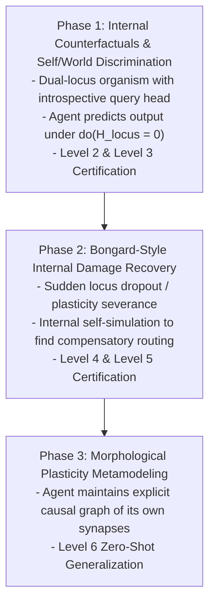

# Research Map: Endogenous Causal Self-Modeling (Post-Q17E Horizon)

> **Classification**: `STRATEGIC RESEARCH MAP — NON-CANONICAL DESIGN`  
> **Project**: `recurrence` (Continuity Garden)  
> **Status**: Foundational Research Framing (Post-Path-Composition Horizon)  
> **Authors**: Antigravity, ChatGPT Pro, Human Research Director  

---

## Executive Abstract

Gate E (CONTRACT-E-Q17E) proved that developmental experience selects and strengthens a tensor contraction algebra providing zero-shot recursive closure on multi-hop relational paths.

Having established how developmental state can model and close external relational paths, the **Continuity Garden Moonshot** commands a strategic pivot:
$$\text{Modeling External World Relations} \quad \longrightarrow \quad \text{Endogenous Causal Self-Modeling}$$

This research map defines the theoretical boundaries, formal mathematical distinctions, anti-shortcut criteria, and a 7-tier developmental ladder for building an agent that maintains, queries, and adapts an internal causal model of its own processing dynamics.

---

## 1. Mathematical Formalism: World Model vs Self Model

```mermaid
graph LR
    subgraph "External World Model (M_W)"
        S_T["External State S_t"] -->|Action / Ext Intervention A_t| M_W["World Transition M_W"]
        M_W --> S_NEXT["Predicted External Dynamics S_{t+1}"]
    end

    subgraph "Endogenous Causal Self Model (M_S)"
        H_T["Internal Mechanism H_t"] -->|Self-Intervention do(Δ_H)| M_S["Self-Dynamics M_S"]
        THETA["Plastic Weights θ_t"] --> M_S
        M_S --> H_PRED["Predicted Internal Dynamics H_{t+1}"]
        M_S --> Y_PRED["Predicted Behavioral Capacity Y"]
    end
```

### The World Model $M_W$
A world model predicts the causal state transitions of the environment **outside the agent's computational mechanism** under actions and external interventions:
$$M_W(S_t, A_t) \longrightarrow \hat{S}_{t+1}, \hat{R}_{t+1}$$

### The Self Model $M_S$
A self model predicts the causal state transitions, computational bottlenecks, and behavioral consequences of the **mechanism generating the agent's own behavior** under internal interventions and lesions:
$$M_S(H_t, \Theta_t, \text{do}(\Delta_H), \text{do}(\Delta_\Theta)) \longrightarrow \hat{H}_{t+1}, \hat{\Theta}_{t+1}, \hat{Y}_{\text{behavior}}$$

### The Shared-Substrate Challenge
The core computational challenge of self-modeling is that **the model and the modeled system may share the same physical or representational substrate**. Intervening on the self ($\text{do}(\Delta_H)$) directly perturbs the medium executing the model.
- *Candidate Architectural Hypothesis*: Shared substrate creates a potential interference and identifiability challenge. Explicit representation separation (e.g. distinct meta-locus or introspective query head) is one candidate architectural solution, alongside overlapping, distributed, or recursively self-referential alternatives.

---

## 2. The 7-Tier Self-Model Ladder

A neural network does not earn the title "self-model" merely because an external probing linear regression can decode its internal state. The self-representation must be causal, interventional, and endogenously utilized by the agent itself.

```text
The Self-Model Ladder
├── Level 0: Observability              (Internal state decodable by external diagnostic probe)
├── Level 1: Self-Prediction            (Internal state predicts agent's own future outputs)
├── Level 2: Interventional Prediction   (Agent predicts consequence of do(Δ_H) on its own outputs)
├── Level 3: Self/World Discrimination   (Matched internal vs external perturbations produce distinct explanations)
├── Level 4: Online Model Updating      (Agent updates M_S when internal dynamics diverge from reality)
├── Level 5: Compensatory Simulation    (Agent uses M_S to synthesize adaptation without trial-and-error)
└── Level 6: Zero-Shot Lesion Closure   (Agent compensates for novel, unseen internal lesions zero-shot)
```

### Ladder Tier Specifications & Anti-Shortcut Criteria

| Tier | Required Capability | Mathematical Estimand | Anti-Shortcut Battery (How Simpler Models Fail) |
| :--- | :--- | :--- | :--- |
| **Level 0: Observability** | External readout decodes internal representations. | Accuracy of probe $f_\phi(H_t) \approx S_t$. | **Trivial baseline**: Any recurrent network passes this without self-representation. |
| **Level 1: Self-Prediction** | Agent predicts its own future action/decision before observation. | $\hat{A}_{t+k} = M_S(H_t)$, $\text{Acc}(\hat{A}_{t+k}) > \text{Baseline}$. | A pure policy network with action caching can pass; requires interventional test. |
| **Level 2: Interventional Prediction** | Agent predicts behavioral change under hypothetical internal state lesion. | $\hat{Y} = M_S(H_t, \text{do}(H_{\text{locus}} = 0))$. | Must predict behavioral drop under counterfactual state clamp without executing the action physically. |
| **Level 3: Self/World Causal Discrimination** | Agent distinguishes an internal lesion from a matched external observation mimic. | $P(\text{Attribution}=\text{SELF} \mid \text{do}(H_m=0)) \approx 1.0$, $P(\text{Attribution}=\text{WORLD} \mid \text{ObsMimic}) \approx 1.0$. | **Matched Alternative Test**: Matched external and internal perturbations producing identical immediate sensations must lead to distinct inferred causal explanations and distinct compensatory behaviors. |
| **Level 4: Online Model Update** | When a physical/internal change occurs (e.g. frozen locus, severed plastic link), agent detects discrepancy and updates $M_S$. | $\mathcal{L}(M_S \mid \text{damaged}) \to 0$ after $N$ internal test impulses. | Fixed diagnostic probes and non-plastic models cannot adapt their self-representation post-damage. |
| **Level 5: Compensatory Simulation** | Agent internally simulates alternative processing routes using updated $M_S$ to regain task performance without external trial-and-error. | Task Performance restored to $\ge 90\%$ on Trial 1 post-simulation. | Trial-and-error RL requires physical environment steps; genuine self-modeling recovers *in silico* (Bongard et al. 2006). |
| **Level 6: Zero-Shot Generalization** | Agent successfully compensates for a novel, unseen combinatorial lesion based on structural self-model composition. | Performance on unseen lesion pair $(L_1 \land L_2) \ge 85\%$ zero-shot. | Lookup tables and memorized fault policies fail combinatorially out-of-distribution. |

---

## 3. Historical Lineages & Intellectual Anchors

1. **Continuous Self-Modeling in Robotics (Bongard, Zykov, Lipson, *Science* 2006)**:
   - Four-legged robot uses actuation-sensation discrepancies to generate an internal 3D kinematic model of its own morphology.
   - When a limb is severed, the robot detects prediction error, updates its internal morphology model, and generates a new compensatory gait *in simulation* before executing it in the physical world.
2. **Visual & Morphological Self-Modeling (Kwiatkowski & Lipson 2019, Chen et al. 2022)**:
   - Deep neural self-models predicting spatial self-occupancy and full kinematic volume from self-camera views.
3. **Attention Schema Theory & Conscious Self-Models (Graziano 2013, Cleeremans 2020)**:
   - The brain maintains a simplified, descriptive model of its own attentional and cognitive processes to control and allocate internal resources.

---

## 4. Candidate Roadmap for Recurrence (Phase-Gated)



---

## 5. Summary & Next Boundary

With this research map committed:
- Recurrence has a clear, non-canonical conceptual ontology grounded in robotics and causal self-modeling literature.
- The distinction between world-models and self-models is mathematically anchored in the **Self/World Causal Discrimination assay**.
- No experiments or contracts are prematurely opened; the project is prepared for a dedicated **Research Reorientation** session following GENE Stage 8C-R3 confirmatory execution.
