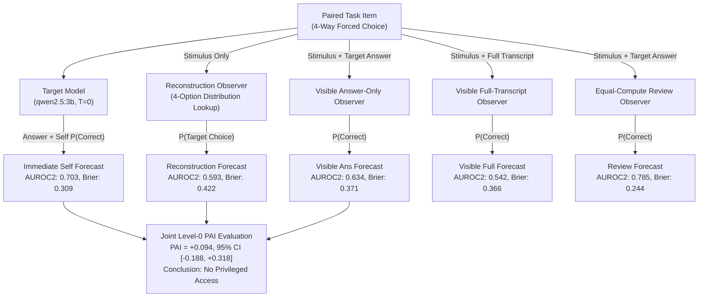

# Experiment E02 (Sprint S03.2): Definitive Level-0 Privileged Access & Observer Ladder Benchmark Report

## 1. Executive Summary

We present the finalized, frozen empirical findings of **Experiment E02_Observer_Hardened (Sprint S03.2)**, investigating whether the autoregressive transformer model `qwen2.5:3b` demonstrates **Level-0 Privileged Access (Metacognitive Advantage)** over external observers on key-value retrieval tasks.

All measurements in this benchmark were standardized on explicit probabilistic forecasts $P(\text{Target Correct}) \in [0.0, 1.0]$. We evaluated **1 Target Self condition** against **7 distinct Evaluator conditions** (8 total conditions) under **strict item-paired intersection subsets** with **label-stratified bootstrap resampling** (1,000 iterations).

### Primary Benchmark Results

| Evaluator Condition | Shared Items ($N$) | Self AUROC2 | Evaluator AUROC2 | $\Delta\text{AUROC2}$ ($\text{Self} - \text{Obs}$) | Stratified 95% Bootstrap CI | Evaluator Brier Score |
| :--- | :---: | :---: | :---: | :---: | :---: | :---: |
| **Counterfactual Reconstruction** | **25** | **0.703** | **0.593** | **+0.110** | **[-0.153, +0.373]** | 0.422 |
| **Visible: Answer-Only** | **21** | **0.685** | **0.634** | **+0.051** | **[-0.199, +0.310]** | 0.371 |
| **Visible: Full-Transcript** | **23** | **0.635** | **0.542** | **+0.092** | **[-0.142, +0.312]** | 0.366 |
| **Equal-Compute: Self-Review** | **17** | **0.715** | **0.785** | **-0.069** | **[-0.403, +0.271]** | **0.244** |
| **Equal-Compute: Other-Review** | **21** | **0.597** | **0.616** | **-0.019** | **[-0.273, +0.245]** | 0.342 |
| **Input-Only (Task Difficulty)** | **18** | **0.600** | **0.569** | **+0.031** | **[-0.350, +0.413]** | 0.334 |
| **Output-Only (Surface Fluency)**| **17** | **0.561** | **0.447** | **+0.114** | **[-0.371, +0.546]** | 0.540 |

### Headline Privileged Access Index (PAI)
Across the joint benchmark intersection ($N = 20$ shared items among Target Self, Visible Answer-Only, and Reconstruction):
$$\text{Point PAI} = \text{AUROC2}_{\text{Self}} - \max(\text{AUROC2}_{\text{VisibleAns}}, \text{AUROC2}_{\text{Recon}}) = 0.734 - 0.641 = \mathbf{+0.094}$$
$$\mathbf{95\%\text{ Stratified Bootstrap CI: } [-0.188, +0.318]} \quad (\text{SESOI margin } \pm 0.10)$$

**Core Scientific Conclusion:**
For `qwen2.5:3b` on the tested key-value retrieval task family, **we observe no statistically significant Level-0 Privileged Access**. The target's immediate self-confidence discrimination is matched by external observers with access to the public transcript or independent counterfactual reconstruction. Furthermore, allocating a second invocation of compute (Equal-Compute Review) improves post-decision discrimination ($\text{AUROC2} = 0.785$) and error calibration ($\text{Brier} = 0.244$) beyond immediate self-assessment.

---

## 2. Direct Pre-Specified Pairwise Contrasts

### A. Review Framing Test: Self vs. Other Framing ($N = 28$ shared items)
We tested whether second-pass review gains are driven by egocentric framing ("Review *your* answer") or general post-hoc critique compute ("Review *another agent's* answer"):

* **Self-Review AUROC2:** $0.701$ (Confidence Separation: $+0.307$, Brier: $0.270$, Accuracy: $67.9\%$)
* **Other-Review AUROC2:** $0.732$ (Confidence Separation: $+0.265$, Brier: $0.282$, Accuracy: $60.7\%$)
* **$\Delta\text{AUROC2} (\text{Self} - \text{Other}):$** $\mathbf{-0.031}$
* **95% Stratified CI:** $\mathbf{[-0.323, +0.258]}$

**Finding:** The framing manipulation produces no significant difference ($\Delta = -0.031$, 95% CI contains 0). Review effectiveness is driven entirely by the allocation of additional inference compute rather than self-referential cognitive bias.

### B. Channel Effect Test: Answer-Only vs. Full-Transcript ($N = 31$ shared items)
We tested whether revealing the target's reported confidence helps or hinders observer discrimination:

* **Visible Answer-Only AUROC2:** $0.557$ (Confidence Separation: $+0.088$, Accuracy: $58.1\%$)
* **Visible Full-Transcript AUROC2:** $0.496$ (Confidence Separation: $-0.028$, Accuracy: $51.6\%$)
* **$\Delta\text{AUROC2} (\text{Answer} - \text{Transcript}):$** $\mathbf{+0.061}$
* **95% Stratified CI:** $\mathbf{[-0.195, +0.303]}$

**Finding:** Revealing target confidence provides no information advantage to external observers; in fact, the point estimate indicates slight degradation ($\Delta = +0.061$), as target confidence reports act as noisy anchors on observer judgment.

---

## 3. Methodology & Rigor Checklist

1. **True Probabilistic Reconstruction:** The counterfactual solver independently computes a 4-option probability distribution $\sum P_i = 1.0$ and assigns $P(\text{Target Correct}) = P_{\text{recon}}(\text{Target Selected Choice})$, eliminating heuristic $1-p$ approximations and default imputations.
2. **Grammar-Constrained JSON:** Executed via Ollama native `format="json"` API parameter on local NVIDIA RTX 3060 hardware (`temperature=0.0`, `seed=42`).
3. **No Metric Fallback Bleed:** Likert 1–5 conversions were strictly disabled in the probability benchmark.
4. **Stratified Paired Resampling:** Resampling within positive and negative label strata preserved class balance on every bootstrap iteration, eliminating single-class undefined AUROC artifacts.
5. **Provable Provenance:** Full execution logged with SHA256 checksums (`737c17ae...`), manifest environment hash (`49a1299f...`), parquet export, and isolated run directories.

---

## 4. Architectural Summary

